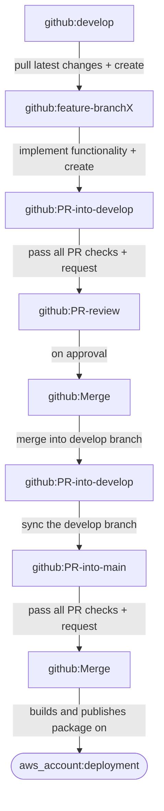

# johndemo2

repo for demo2.

## Contribution Workflow

```mermaid
graph TB
  f0[github:develop] -->|pull latest changes + create| A1;
  A1[github:feature-branchX] -->|implement functionality + create| A2;
  A2[github:PR-into-develop] -->|pass all PR checks + request| A3;
  A3[github:PR-review] -->|on approval| A4;
  A4[github:Merge] -->|merge into develop branch| A5;
  A5[github:PR-into-develop] -->|sync the develop branch| A6;
  A6[github:PR-into-main] -->|pass all PR checks + request| A7;
  A7[github:Merge] -->|builds and publishes package on| B1([aws_account:deployment]);
```
